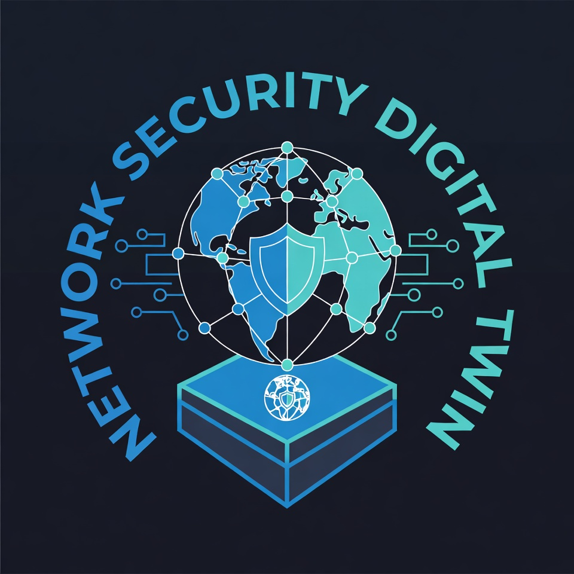
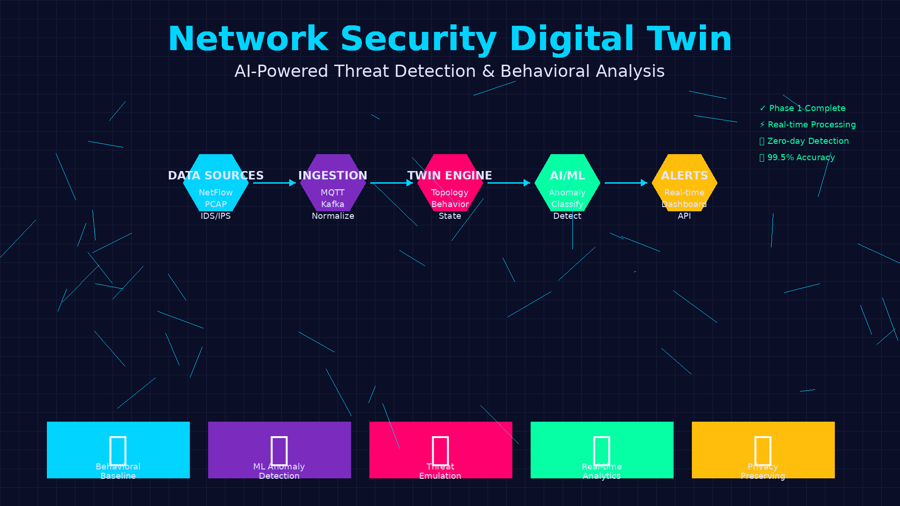

# Network Security Digital Twin - AI-Powered Threat Detection

A comprehensive platform for **mirroring real network environments** to observe, simulate, and analyze traffic behavior for **AI/ML-based security threat detection** without impacting production systems.

## 📋 Table of Contents

- [Overview](#overview)
- [Core Objectives](#core-objectives)
- [System Architecture](#system-architecture)
- [Network Behavior Modeling](#network-behavior-modeling)
- [Prerequisites](#prerequisites)
- [Installation](#installation)
- [Project Structure](#project-structure)
- [Configuration](#configuration)
- [Running the System](#running-the-system)
- [Phased Implementation](#phased-implementation)
- [Usage Examples](#usage-examples)
- [API Documentation](#api-documentation)
- [Troubleshooting](#troubleshooting)
- [Next Steps](#next-steps)

---

## 🎯 Overview



This project implements a **Network Security Digital Twin** - a virtual replica of production networks that enables:

- **Safe threat emulation** and red-teaming exercises without production impact
- **AI/ML-based anomaly detection** using behavioral analysis
- **DPI-inspired feature extraction** from traffic metadata (without payload inspection)
- **Cyber-range capabilities** for security training and validation
- **Privacy-preserving analysis** using flow data and metadata
- **Real-time and accelerated simulation** for rapid scenario testing

### What is a Network Digital Twin?

A network digital twin is a configurable, high-fidelity virtual model that mirrors:
- **Network topology** - Routers, switches, firewalls, devices, and links
- **Traffic patterns** - Flow characteristics, protocol distributions, and timing
- **Behavioral baselines** - Normal vs. anomalous traffic signatures
- **Security policies** - Firewall rules, access controls, and rate limits
- **Threat scenarios** - Simulated attacks for detection testing

## 🧠 Core Objectives



### AI Security Through Behavioral Analysis

The primary goal is to **generate high-quality behavioral data** for training AI models to detect:
- Malicious network activity (DDoS, tunneling, lateral movement)
- Protocol anomalies and misconfigurations
- Zero-day threats through behavior deviation
- Covert channels and data exfiltration

**Focus**: Traffic behavior and metadata analysis, NOT payload inspection - ensuring privacy, scalability, and compliance.

---

## 🧠 Network Behavior Modeling for AI Security

A core objective of this project is to **twin real and simulated networks** in order to generate high-quality behavioral data for **training AI models to detect malicious and anomalous network activity**.

Instead of inspecting packet payloads, the system focuses on **traffic behavior and metadata**, which is safer, scalable, and aligned with modern defensive security practices.

---

### 🔹 Normal Network Behavior (Baseline)

The Digital Twin learns and models what *healthy* network traffic looks like, including:

- **Packet rate** – Average and peak packets per second
- **Protocol distribution** – Typical ratios of TCP / UDP / ICMP traffic
- **Session duration** – Normal connection lifetimes
- **Latency & jitter** – Expected response times and variation
- **Retry patterns** – Normal retransmission behavior
- **DNS request frequency** – Standard domain resolution patterns
- **TLS handshake behavior** – Legitimate encrypted session setup characteristics

These metrics form the **baseline profile** used by the AI model.

---

### 🔹 Abnormal / Suspicious Network Behavior

The system also models and simulates deviations from the baseline, which may indicate malicious or misconfigured activity:

- **Sudden traffic spikes** – Abnormal surges in packet rate
- **Unusual protocol mix** – Unexpected protocol ratios
- **Repeated failed connections** – Authentication or connection failures
- **High entropy payload sizes** – Indicators of obfuscation or tunneling
- **Timing anomalies** – Irregular or unnatural traffic intervals
- **Connection floods** – Excessive simultaneous connections
- **Beacon-like periodic traffic** – Repeated, timed outbound signals

These behaviors are used to **label events**, **train anomaly-detection models**, and **evaluate AI predictions**.

---

### 🧪 Why Network Digital Twins Matter

By using Network Digital Twins, the project enables:

- **Safe simulation** - Test threats without production impact
- **Accurate labeling** - Clear normal vs suspicious behavior classification
- **Repeatable experiments** - Consistent AI training and evaluation
- **Continuous learning** - Retraining as network conditions evolve
- **Privacy preservation** - Metadata analysis without payload inspection
- **Threat emulation** - Controlled attack scenarios for testing

This approach supports **behavior-based threat detection**, which is more resilient than traditional signature-based systems.

---

## 🏗️ System Architecture

```
┌─────────────────────────────────────────────────────────────────────────┐
│                   Network Security Digital Twin Platform                 │
├─────────────────────────────────────────────────────────────────────────┤
│                                                                           │
│  ┌──────────────────────────────────────────────────────────────────┐  │
│  │                     DATA PLANE (Real Network)                     │  │
│  │  - NetFlow/IPFIX collectors                                       │  │
│  │  - sFlow sensors                                                  │  │
│  │  - Packet captures (PCAP)                                         │  │
│  │  - IDS/IPS logs (Snort, Suricata)                                │  │
│  │  - DPI-capable sensors                                            │  │
│  │  - System/application logs                                        │  │
│  │  - Network device telemetry                                       │  │
│  └────────────────┬─────────────────────────────────────────────────┘  │
│                   │                                                      │
│                   │ Traffic Data, Flow Records, Events                  │
│                   ▼                                                      │
│  ┌──────────────────────────────────────────────────────────────────┐  │
│  │              DATA INGESTION & NORMALIZATION LAYER                 │  │
│  │  - MQTT Broker (Mosquitto) - Real-time event streaming           │  │
│  │  - Data Lake - Raw data storage                                   │  │
│  │  - Schema normalization (flows, events, metadata)                │  │
│  │  - Data lineage tracking                                          │  │
│  └────────────────┬─────────────────────────────────────────────────┘  │
│                   │                                                      │
│                   │ Normalized Events, Flows, Metadata                  │
│                   ▼                                                      │
│  ┌──────────────────────────────────────────────────────────────────┐  │
│  │                  DIGITAL TWIN ENGINE                              │  │
│  │  ┌────────────────────────────────────────────────────────────┐  │  │
│  │  │  Network Model (Topology, Devices, Links, Policies)        │  │  │
│  │  │  - Graph database (network topology)                        │  │  │
│  │  │  - Device profiles & capabilities                           │  │  │
│  │  │  - Traffic baselines & behavior models                      │  │  │
│  │  │  - Time virtualization (real-time/accelerated)              │  │  │
│  │  └────────────────────────────────────────────────────────────┘  │  │
│  └────────────────┬─────────────────────────────────────────────────┘  │
│                   │                                                      │
│                   │ Twin State, Topology, Metrics                        │
│                   ▼                                                      │
│  ┌──────────────────────────────────────────────────────────────────┐  │
│  │              AI/ML ANALYTICS & DETECTION LAYER                    │  │
│  │  ┌────────────────────────────────────────────────────────────┐  │  │
│  │  │  Behavioral Analysis Engines                               │  │  │
│  │  │  - Baseline modeling (normal behavior)                     │  │  │
│  │  │  - Anomaly detection (statistical + ML)                    │  │  │
│  │  │  - Protocol behavior analysis                              │  │  │
│  │  │  - DPI-inspired feature extraction (metadata-based)        │  │  │
│  │  │  - Threat classification models                            │  │  │
│  │  │  - Risk scoring & explainability                           │  │  │
│  │  └────────────────────────────────────────────────────────────┘  │  │
│  │  ┌────────────────────────────────────────────────────────────┐  │  │
│  │  │  Threat Emulation & Cyber-Range                            │  │  │
│  │  │  - Synthetic attack generation                             │  │  │
│  │  │  - Red team / Blue team scenarios                          │  │  │
│  │  │  - Response orchestration (SOAR integration)               │  │  │
│  │  │  - Detection effectiveness testing                         │  │  │
│  │  └────────────────────────────────────────────────────────────┘  │  │
│  └────────────────┬─────────────────────────────────────────────────┘  │
│                   │                                                      │
│                   │ Alerts, Anomalies, Threat Scores                    │
│                   ▼                                                      │
│  ┌──────────────────────────────────────────────────────────────────┐  │
│  │                    REST API LAYER (Flask)                         │  │
│  │  - Twin management endpoints                                      │  │
│  │  - Traffic analytics queries                                      │  │
│  │  - Anomaly detection results                                      │  │
│  │  - Threat scenario controls                                       │  │
│  │  - Model performance metrics                                      │  │
│  └────────────────┬─────────────────────────────────────────────────┘  │
│                   │                                                      │
│                   │ HTTP/REST                                            │
│                   ▼                                                      │
│  ┌──────────────────────────────────────────────────────────────────┐  │
│  │             VISUALIZATION & CYBER-RANGE UX                        │  │
│  │  - Network topology visualization                                 │  │
│  │  - Anomaly heatmaps                                               │  │
│  │  - Real-time alert streams                                        │  │
│  │  - ML model confidence dashboards                                 │  │
│  │  - Scenario scripting UI (red/blue team)                          │  │
│  │  - Incident replay & playback controls                            │  │
│  └──────────────────────────────────────────────────────────────────┘  │
│                                                                           │
│  ┌──────────────────────────────────────────────────────────────────┐  │
│  │          GOVERNANCE, PRIVACY & SAFETY LAYER                       │  │
│  │  - Data minimization (no sensitive payloads)                      │  │
│  │  - Tokenization & synthetic data                                  │  │
│  │  - Access control & audit logs                                    │  │
│  │  - Compliance mapping (GDPR, sector norms)                        │  │
│  └──────────────────────────────────────────────────────────────────┘  │
│                                                                           │
└─────────────────────────────────────────────────────────────────────────┘
```

### Architecture Layers

| Layer | Purpose | Technologies |
|-------|---------|--------------|
| **Data Plane** | Collect network traffic and events | NetFlow/IPFIX, sFlow, PCAP, IDS/IPS, DPI sensors |
| **Ingestion** | Normalize and stream data | MQTT (Mosquitto), Kafka (Phase 2), Data Lake |
| **Twin Engine** | Model network topology and behavior | Python, Graph DB (Neo4j), Time-series DB |
| **AI/ML Analytics** | Detect anomalies and threats | scikit-learn, TensorFlow/PyTorch, Feature stores |
| **API Layer** | External interface | Flask REST API |
| **Visualization** | Monitoring and control | Web dashboard, Grafana (Phase 3) |
| **Governance** | Privacy and compliance | Access control, audit logs, data minimization |

---

## 📦 Prerequisites

### System Requirements

- **Operating System**: Linux (Ubuntu 20.04+ / Debian 10+ recommended)
- **RAM**: Minimum 2GB
- **Disk Space**: 500MB free space
- **Network**: Internet connection for initial setup

### Required Software

- **Python**: Version 3.8 or higher
- **pip**: Python package manager
- **VS Code**: Latest stable version
- **Git**: For version control (optional)

---

## 🚀 Installation

### Step 1: Update System Packages

Open your terminal and update the package list:

```bash
sudo apt update
sudo apt upgrade -y
```

### Step 2: Install Core Dependencies

Install Python, pip, and the Mosquitto MQTT broker:

```bash
# Install Python and pip
sudo apt install python3 python3-pip -y

# Install Mosquitto MQTT Broker and clients
sudo apt install mosquitto mosquitto-clients -y

# Verify installations
python3 --version
pip3 --version
mosquitto -h
```

### Step 3: Install Python Libraries

Install required Python packages:

```bash
# Core libraries
pip3 install paho-mqtt flask

# Additional useful libraries
pip3 install flask-cors requests python-dotenv
```

### Step 4: Configure Mosquitto MQTT Broker

Enable and start the Mosquitto service:

```bash
# Start Mosquitto service
sudo systemctl start mosquitto

# Enable Mosquitto to start on boot
sudo systemctl enable mosquitto

# Check service status
sudo systemctl status mosquitto
```

Create a basic Mosquitto configuration (optional):

```bash
sudo nano /etc/mosquitto/conf.d/custom.conf
```

Add the following content:

```conf
listener 1883
allow_anonymous true
```

Restart Mosquitto:

```bash
sudo systemctl restart mosquitto
```

### Step 5: Install VS Code Extensions

Open VS Code and install these extensions:

1. **Python** (ms-python.python)
   - Provides Python language support
   - IntelliSense, linting, debugging

2. **Docker** (ms-azuretools.vscode-docker)
   - Container management
   - Dockerfile support

3. **Remote - SSH** (ms-vscode-remote.remote-ssh)
   - Connect to remote Linux servers
   - Remote development

4. **IoT Device Simulator** (vsciot-vscode.vscode-iot-device-cube-sdk)
   - Simulate IoT devices
   - Test MQTT connections

**Installation Methods:**

**Via VS Code UI:**
- Press `Ctrl+Shift+X`
- Search for each extension
- Click "Install"

**Via Command Line:**

```bash
code --install-extension ms-python.python
code --install-extension ms-azuretools.vscode-docker
code --install-extension ms-vscode-remote.remote-ssh
code --install-extension vsciot-vscode.vscode-iot-device-cube-sdk
```

---

## 📁 Project Structure

Create the project directory structure:

```bash
mkdir -p digital-twin-network/{devices,twins,broker,api,dashboard}
cd digital-twin-network
```

### Complete Directory Layout

```
digital-twin-network/
├── README.md                 # This file
├── requirements.txt          # Python dependencies
├── .env                      # Environment variables
├── .gitignore               # Git ignore file
│
├── devices/                 # Physical device simulators
│   ├── __init__.py
│   ├── device_simulator.py  # Main device simulator
│   ├── sensor_device.py     # Temperature sensor example
│   └── actuator_device.py   # Light control example
│
├── twins/                   # Digital twin models
│   ├── __init__.py
│   ├── twin_model.py        # Twin data model
│   ├── twin_manager.py      # Twin lifecycle management
│   └── schemas/             # JSON schemas for twins
│       ├── sensor_twin.json
│       └── actuator_twin.json
│
├── broker/                  # MQTT configuration
│   ├── mqtt_client.py       # MQTT client wrapper
│   ├── topic_manager.py     # Topic routing logic
│   └── mosquitto.conf       # Custom Mosquitto config
│
├── api/                     # REST API
│   ├── __init__.py
│   ├── app.py              # Flask application
│   ├── routes.py           # API endpoints
│   └── models.py           # Data models
│
└── dashboard/              # Visualization
    ├── index.html          # Main dashboard page
    ├── static/
    │   ├── css/
    │   │   └── style.css
    │   └── js/
    │       └── app.js      # Frontend logic
    └── templates/
        └── base.html
```

### File Purposes

| Directory | Purpose |
|-----------|---------|
| `devices/` | Simulates physical IoT devices sending telemetry data |
| `twins/` | Manages digital twin models and state synchronization |
| `broker/` | Handles MQTT communication and message routing |
| `api/` | Provides REST API for external applications |
| `dashboard/` | Web interface for monitoring and control |

---

## ⚙️ Configuration

### Environment Variables

Create a `.env` file in the project root:

```bash
nano .env
```

Add the following configuration:

```env
# MQTT Broker Configuration
MQTT_BROKER_HOST=localhost
MQTT_BROKER_PORT=1883
MQTT_USERNAME=
MQTT_PASSWORD=
MQTT_KEEPALIVE=60

# Flask API Configuration
FLASK_HOST=0.0.0.0
FLASK_PORT=5000
FLASK_DEBUG=True

# Digital Twin Configuration
TWIN_UPDATE_INTERVAL=5
MAX_TWINS=100
DATA_RETENTION_DAYS=30

# Logging
LOG_LEVEL=INFO
LOG_FILE=digital_twin.log
```

### Requirements File

Create `requirements.txt`:

```bash
nano requirements.txt
```

Add dependencies:

```
paho-mqtt==1.6.1
flask==2.3.0
flask-cors==4.0.0
requests==2.31.0
python-dotenv==1.0.0
```

Install all requirements:

```bash
pip3 install -r requirements.txt
```

---

## 📈 Phased Implementation Plan

### ✅ Phase 1 - Foundation (Current - MVP)

**Goal**: Establish core digital twin infrastructure with basic telemetry

**Components**:
- ✅ MQTT Broker (Mosquitto) for real-time event streaming
- ✅ Digital Twin Engine (basic network device models)
- ✅ Flask REST API for twin management
- ✅ Network device simulators (traffic generators)
- ✅ Basic telemetry collection

**Deliverables**:
- Working MQTT → Twin Engine → Flask API pipeline
- Sample network devices publishing flow-like data
- REST API for querying twin state

---

### 🔄 Phase 2 - Behavioral Baseline & Streaming Analytics

**Goal**: Implement behavior modeling and streaming data pipeline

**Components**:
- 🔲 **Kafka integration** - Scalable event streaming (replaces/augments MQTT)
- 🔲 **Baseline modeling engine**:
  - Packet rate tracking (avg, peak, variance)
  - Protocol distribution analysis (TCP/UDP/ICMP ratios)
  - Session duration profiling
  - Latency & jitter measurements
  - Retry pattern detection
  - DNS request frequency monitoring
  - TLS handshake behavior analysis
- 🔲 **Feature extraction pipeline** - DPI-inspired metadata extraction
- 🔲 **Time-series database** - Historical behavior storage

**Network Behavior Metrics (Normal)**:
- ✅ Packet rate (avg/peak packets per second)
- ✅ Protocol distribution (TCP/UDP/ICMP percentages)
- ✅ Session duration (connection lifetime stats)
- ✅ Latency & jitter (response time characteristics)
- ✅ Retry patterns (retransmission behavior)
- ✅ DNS request frequency (domain resolution patterns)
- ✅ TLS handshake behavior (encrypted session setup)

**Deliverables**:
- MQTT → Kafka → Twin Engine pipeline
- Behavioral baseline models for normal traffic
- Metadata feature store

---

### 🎯 Phase 3 - Anomaly Detection & ML Models

**Goal**: Deploy AI/ML-based threat detection

**Components**:
- 🔲 **Anomaly detection engines**:
  - Sudden traffic spikes detection
  - Unusual protocol mix identification
  - Repeated failed connection alerts
  - High entropy payload size detection
  - Timing anomaly recognition
  - Connection flood detection
  - Beacon-like periodic traffic identification
- 🔲 **ML model training pipeline**
- 🔲 **Grafana dashboards** - Real-time visualization
- 🔲 **Alert correlation system**
- 🔲 **Risk scoring engine**

**Network Behavior Anomalies (Suspicious)**:
- 🔲 Sudden traffic spikes (abnormal packet rate surges)
- 🔲 Unusual protocol mix (unexpected TCP/UDP/ICMP ratios)
- 🔲 Repeated failed connections (auth/connection failures)
- 🔲 High entropy payload sizes (obfuscation indicators)
- 🔲 Timing anomalies (irregular traffic intervals)
- 🔲 Connection floods (excessive simultaneous connections)
- 🔲 Beacon-like periodic traffic (C2 communication patterns)

**Deliverables**:
- Kafka → Database → Grafana visualization
- Trained ML models for anomaly detection
- Real-time anomaly alerting
- Performance dashboards

---

### 🛡️ Phase 4 - Threat Emulation & Cyber-Range

**Goal**: Enable safe attack simulation and red/blue team exercises

**Components**:
- 🔲 **Threat scenario engine**:
  - DDoS attack simulation
  - Tunneling/covert channel emulation
  - DNS cache poisoning scenarios
  - SQL/XSS injection patterns
  - Lateral movement simulation
- 🔲 **SOAR integration** - Automated response playbooks
- 🔲 **Detection effectiveness metrics**
- 🔲 **Security training modules**

**Deliverables**:
- Cyber-range environment for controlled attack testing
- Automated threat response workflows
- Detection performance analytics

---

### 🚀 Phase 5 - Advanced DPI & Operations

**Goal**: Deep protocol inspection and production readiness

**Components**:
- 🔲 **DPI-inspired deep analysis**:
  - Protocol sequence anomaly detection
  - Tunnel anomaly identification
  - Advanced payload pattern recognition (metadata-based)
- 🔲 **Continuous learning pipeline** - Model drift detection
- 🔲 **Data governance framework**:
  - Access control & audit trails
  - Privacy-preserving data handling
  - Compliance reporting (GDPR, etc.)
- 🔲 **Multi-domain support** - Cross-organization data sharing

**Deliverables**:
- Production-ready platform with governance
- Continuous model training and deployment
- Enterprise-grade security and compliance

---

## 🎯 Current Status: Phase 1 Complete

**Completed**:
- ✅ MQTT broker configuration
- ✅ Digital twin engine foundation
- ✅ REST API implementation
- ✅ Network device simulators
- ✅ Basic telemetry collection

**Next Steps** (Phase 2):
1. Integrate Kafka for scalable streaming
2. Implement baseline behavior modeling
3. Add metadata feature extraction
4. Deploy time-series database

---

## 🏃 Running the System

### Step 1: Verify MQTT Broker

Test the MQTT broker is running:

```bash
# Subscribe to network flow topic (Terminal 1)
mosquitto_sub -h localhost -t "network/+/flow"

# Publish sample flow data (Terminal 2)
mosquitto_pub -h localhost -t "network/router-001/flow" \
  -m '{"protocol":"TCP","packets":1000,"bytes":65000,"latency_ms":25}'
```

You should see the flow data appear in Terminal 1.

### Step 2: Start the Digital Twin Engine

```bash
cd digital-twin-network
python3 twins/twin_manager.py
```

This starts the network twin engine that:
- Subscribes to network telemetry topics
- Maintains network topology state
- Tracks traffic baselines
- Detects behavioral anomalies

### Step 3: Launch Network Device Simulators

In a new terminal:

```bash
python3 devices/network_simulator.py
```

This simulates network nodes publishing:
- Flow records (NetFlow/IPFIX-like data)
- Protocol statistics
- Connection events
- Traffic patterns (normal and anomalous)

### Step 4: Start the REST API

In another terminal:

```bash
python3 api/app.py
```

The API will be available at `http://localhost:5000`

API provides endpoints for:
- Network twin state queries
- Traffic pattern analysis
- Anomaly detection results
- Behavioral baseline metrics

### Step 5: Access the Dashboard (Optional)

```bash
cd dashboard
python3 -m http.server 8080
```

Access at `http://localhost:8080` for:
- Network topology visualization
- Real-time traffic metrics
- Anomaly alerts
- Behavioral baseline graphs

---

## 💡 Usage Examples

### Monitoring Network Flow via API

```bash
# Get all network twins (nodes/devices)
curl http://localhost:5000/api/v1/twins

# Get specific network node
curl http://localhost:5000/api/v1/twins/router-001

# Get traffic statistics
curl http://localhost:5000/api/v1/twins/router-001/statistics

# Get telemetry data
curl http://localhost:5000/api/v1/twins/router-001/telemetry
```

### Publishing Network Telemetry via MQTT

```bash
# Publish flow record
mosquitto_pub -h localhost \
  -t "network/router-001/flow" \
  -m '{
    "src_ip": "192.168.1.10",
    "dst_ip": "10.0.0.5",
    "protocol": "TCP",
    "src_port": 49152,
    "dst_port": 443,
    "packets": 150,
    "bytes": 98304,
    "duration_sec": 5.2,
    "flags": "ACK"
  }'

# Publish protocol statistics
mosquitto_pub -h localhost \
  -t "network/router-001/stats" \
  -m '{
    "tcp_packets": 45000,
    "udp_packets": 12000,
    "icmp_packets": 150,
    "total_bytes": 32505600,
    "active_connections": 523
  }'

# Subscribe to anomaly alerts
mosquitto_sub -h localhost -t "network/+/anomaly"
```

### Python Client Example - Normal vs Anomalous Traffic

```python
import paho.mqtt.client as mqtt
import json
import time

# Connect to broker
client = mqtt.Client()
client.connect("localhost", 1883, 60)

# Simulate NORMAL traffic baseline
print("Publishing normal traffic baseline...")
for i in range(100):
    normal_flow = {
        "node_id": "router-001",
        "protocol": "TCP",
        "packets_per_sec": 1000 + (i % 50),  # Normal variance
        "avg_latency_ms": 25 + (i % 5),
        "tcp_ratio": 0.75,
        "udp_ratio": 0.23,
        "icmp_ratio": 0.02,
        "session_duration_sec": 30 + (i % 20),
        "connection_failures": 2
    }

    client.publish("network/router-001/flow", json.dumps(normal_flow))
    time.sleep(0.1)

# Simulate ANOMALOUS traffic (DDoS attack)
print("Publishing anomalous traffic pattern...")
anomaly_flow = {
    "node_id": "router-001",
    "protocol": "TCP",
    "packets_per_sec": 50000,      # 50x normal - SPIKE DETECTED
    "avg_latency_ms": 250,          # 10x normal - HIGH LATENCY
    "tcp_ratio": 0.99,              # Unusual protocol distribution
    "udp_ratio": 0.01,
    "icmp_ratio": 0.00,
    "connection_failures": 450,     # High failure rate
    "syn_flood_indicator": True,    # Attack pattern
    "entropy": 0.95                 # High entropy
}

client.publish("network/router-001/flow", json.dumps(anomaly_flow))
print("Anomaly published - check for detection alerts!")
```

---

## 📚 API Documentation

### Base URL
```
http://localhost:5000/api/v1
```

### Endpoints

#### Get All Twins
```
GET /twins
```
**Response:**
```json
{
  "count": 2,
  "twins": [
    {
      "id": "sensor-001",
      "type": "temperature_sensor",
      "state": {
        "temperature": 23.5,
        "humidity": 65
      },
      "last_updated": "2024-02-05T10:30:00Z"
    }
  ]
}
```

#### Get Single Twin
```
GET /twins/{twin_id}
```

#### Send Command
```
POST /twins/{twin_id}/command
Content-Type: application/json

{
  "action": "set_temperature",
  "value": 25
}
```

#### Update Twin State
```
PUT /twins/{twin_id}/state
Content-Type: application/json

{
  "temperature": 24.0,
  "humidity": 68
}
```

---

## 🔧 Troubleshooting

### Common Issues

**1. Mosquitto fails to start**
```bash
# Check service status
sudo systemctl status mosquitto

# View logs
sudo journalctl -u mosquitto -f

# Verify port is not in use
sudo netstat -tlnp | grep 1883
```

**2. Python module not found**
```bash
# Reinstall packages
pip3 install --upgrade -r requirements.txt

# Check Python path
python3 -c "import sys; print(sys.path)"
```

**3. Permission denied errors**
```bash
# Add user to required groups
sudo usermod -aG dialout $USER
sudo usermod -aG mosquitto $USER

# Re-login to apply changes
```

**4. Port already in use**
```bash
# Find process using port 5000
sudo lsof -i :5000

# Kill process if needed
kill -9 <PID>
```

### Testing Connectivity

```bash
# Test MQTT connection
mosquitto_sub -h localhost -t "#" -v

# Test API
curl http://localhost:5000/health

# Check Python imports
python3 -c "import paho.mqtt.client; import flask; print('OK')"
```

---

## 🎓 Next Steps & Roadmap

### Immediate Enhancements (Phase 2)

1. **Streaming Infrastructure**
   - Deploy Apache Kafka for high-throughput event streaming
   - Implement Kafka producers for network telemetry
   - Add Kafka consumers for real-time processing

2. **Behavioral Baseline Engine**
   - Statistical modeling of normal traffic patterns
   - Protocol distribution profiling
   - Session duration analysis
   - Latency and jitter tracking
   - Create baseline persistence layer

3. **Metadata Feature Extraction**
   - Flow-level feature extraction (no payload inspection)
   - Protocol behavior signatures
   - Timing and sequence pattern analysis
   - Connection state tracking

4. **Time-Series Storage**
   - Deploy TimescaleDB or InfluxDB
   - Historical behavior data retention
   - Fast time-range queries for analysis

---

### Medium-Term Goals (Phase 3)

1. **ML Model Development**
   - Unsupervised anomaly detection (clustering, autoencoders)
   - Supervised threat classification (labeled attack data)
   - Feature importance analysis
   - Model explainability (SHAP, LIME)

2. **Real-Time Anomaly Detection**
   - Streaming anomaly scoring
   - Alert generation and correlation
   - False positive reduction
   - Confidence thresholding

3. **Visualization & Dashboards**
   - Grafana integration for metrics
   - Network topology visualization
   - Anomaly heatmaps
   - Real-time alert streams
   - Model performance tracking

---

### Long-Term Vision (Phases 4-5)

1. **Cyber-Range Capabilities**
   - Automated threat scenario generation
   - Red team vs blue team simulations
   - Detection effectiveness benchmarking
   - Security training modules

2. **Advanced Analytics**
   - Deep protocol inspection (metadata-based)
   - Behavioral sequence modeling (RNNs, Transformers)
   - Graph-based attack path analysis
   - Threat intelligence integration

3. **Production Hardening**
   - Data governance and privacy controls
   - Access control and audit logging
   - Compliance reporting (GDPR, HIPAA, etc.)
   - High availability and disaster recovery
   - Multi-tenant support

4. **Integration Ecosystem**
   - SIEM integration (Splunk, ELK, QRadar)
   - SOAR platform connectivity (Phantom, Demisto)
   - Threat intelligence feeds (STIX/TAXII)
   - Firewall and IDS/IPS orchestration

---

### Learning Resources

- **Network Security & Threat Detection**:
  - [NIST Cybersecurity Framework](https://www.nist.gov/cyberframework)
  - [MITRE ATT&CK Framework](https://attack.mitre.org/)
  - [Snort IDS Rules](https://www.snort.org/)

- **Digital Twins & Simulation**:
  - [Digital Twin Consortium](https://www.digitaltwinconsortium.org/)
  - [Network Simulation Tools](https://www.nsnam.org/)

- **Machine Learning for Security**:
  - [Anomaly Detection Papers](https://github.com/yzhao062/anomaly-detection-resources)
  - [ML for Cybersecurity](https://github.com/jivoi/awesome-ml-for-cybersecurity)

- **Data Privacy & Compliance**:
  - [GDPR Guidelines](https://gdpr.eu/)
  - [Privacy-Preserving ML](https://github.com/OpenMined/PySyft)

---

### Research Questions & Future Work

**What is your target deployment?**
- Small lab / research environment?
- Campus or enterprise network?
- Service provider / ISP scale?
- 5G/6G mobile network security?

**Privacy Requirements?**
- Hard constraint on payload minimization?
- Need for synthetic data generation?
- Tokenization requirements?
- Compliance mandates (GDPR, HIPAA, etc.)?

**Existing Infrastructure?**
- Current monitoring tools (NetFlow, sFlow, etc.)?
- Available data sources and formats?
- Preferred technology stack?
- Integration requirements?

**Project Scope?**
- Timeline for MVP deployment?
- Budget constraints?
- Team size and expertise?
- Expected traffic volume and variety?

---

## 📄 License

MIT License - Feel free to use and modify for your security research and projects.

## 🤝 Contributing

Contributions welcome! This is an evolving platform for network security research.

Areas for contribution:
- Additional network behavior models
- ML model implementations
- DPI-inspired feature extractors
- Threat scenario generators
- Visualization components
- Integration connectors

## 📞 Support

For questions or collaboration:
- Review the troubleshooting section
- Check system logs for diagnostics
- Test components individually
- Refer to the detailed DOCUMENTATION.md

---

**Building the Future of AI-Powered Network Security** 🚀🔒

*Last Updated: February 2026*~